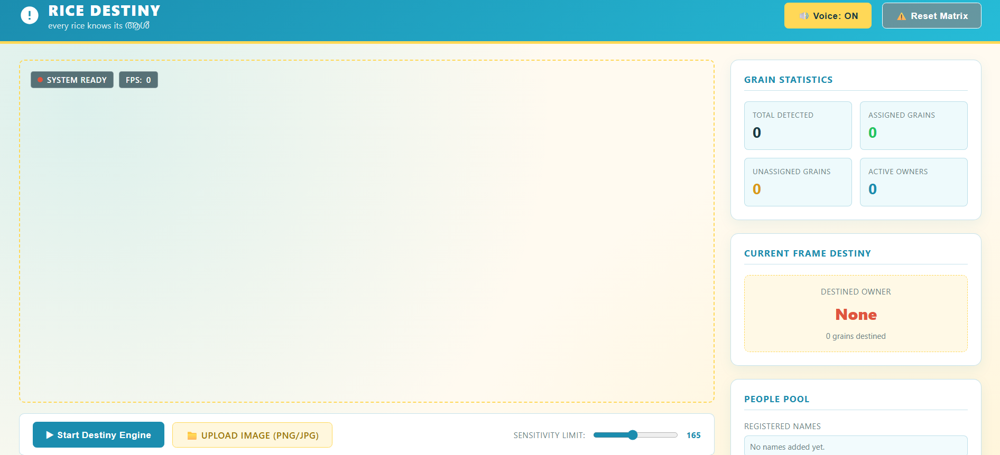
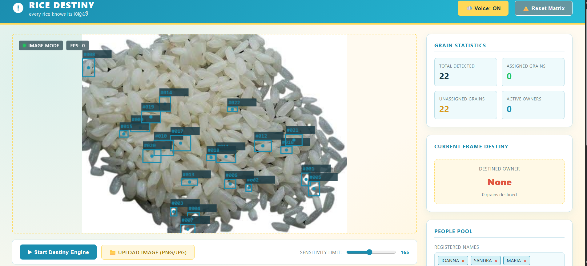
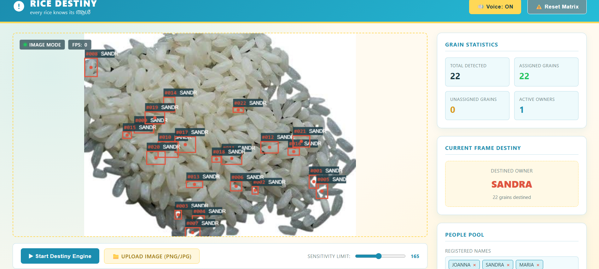
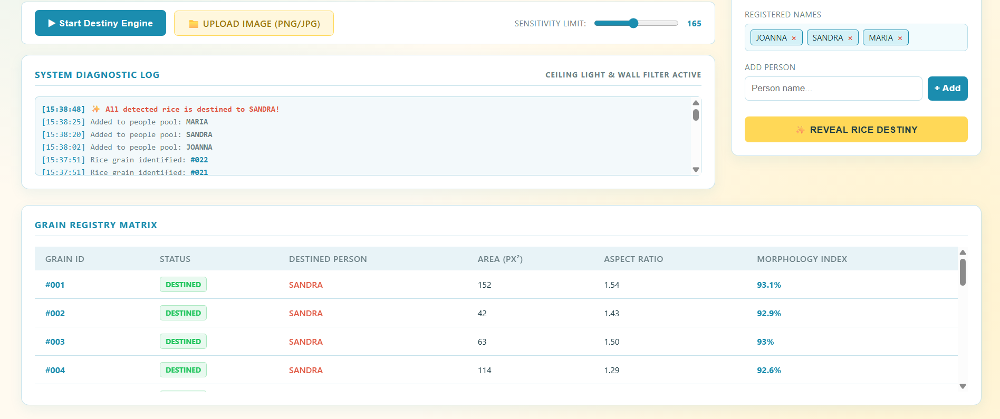
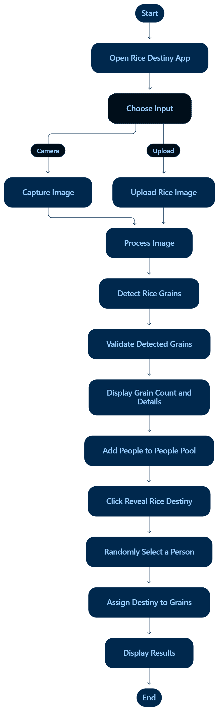

# Rice Destiny 

## Basic Details
### Team Name: Infinix

### Team Members
- Team Lead : Sandra M C - Mar Athanasius College of Engineering, Kothamangalam
- Member 2 :Joanna Mariyam Raju - Mar Athanasius College of Engineering, Kothamangalam

### Project Description
"Lalettan says, 'ഓരോ അരിമണിയിലും അത് കഴിക്കേണ്ടവന്റെ പേര് എഴുതിയിട്ടുണ്ട്' (Every grain of rice has the name of the person who should eat it). But how many of us know which is ours? We will help you find out!"
RiceDestiny is a fun rice detection and “destiny assignment” web app that uses your camera or uploaded image to identify individual rice grains, track them, and randomly decide who gets to eat them.

### The Problem (that doesn't exist)
You're deep into a plate of biryani or mandi, and a terrible thought creeps in — what if a grain meant for your friend has ended up on your plate by mistake? That's not just bad luck, that's a disruption of cosmic rice-balance, and frankly, the meal can't taste right until it's resolved.

### The Solution (that nobody asked for)
[How are you solving it? Keep it fun!]

## Technical Details
### Technologies/Components Used
For Software:

JavaScript (vanilla, no frameworks)
HTML5 / CSS3
Canvas API — getImageData, flood-fill blob detection, frame-to-frame grain tracking
MediaDevices getUserMedia — live camera feed
Web Speech API (SpeechSynthesis) — voice announcements
Single-file app, no build tools required

### Implementation
For Software:
# Installation
git clone 
cd rice-destiny
# Run
1. Open the index.html file in a modern browser (like Chrome).
2. Enter the names of the participants.
3. Click "Start Camera".
4. Point the camera at the scattered grains of rice.
5. Watch the magic happen as your destined grains get discovered!

### Project Documentation
For Software:

# Screenshots (Add at least 3)

A screenshot showing the main interface where participants can add their names and image of rice.

Uploaded rice image with 22 grains detected and highlighted individually.

*Add caption explaining what this shows*

# Diagrams

This diagram illustrates the project's workflow, from user input to OpenCV detection and voice output.

Rice Destiny assigns all 22 detected grains to Sandra and displays the assignment details in the diagnostic log and grain registry.

# Build Photos

*List out all components shown*

*Explain the build steps*

*Explain the final build*

### Project Demo
# Video
[Add your demo video link here]
*Explain what the video demonstrates*

# Additional Demos
[Add any extra demo materials/links]

## Team Contributions
- Sandra M C:  Implemented the computer vision logic for grain detection and tracking. Contributed to the front-end structure and functionality.
- Joanna Mariyam Raju : Implemented the Web Speech API features, including the funny voice responses and multilingual support. Contributed to the front-end design, and wrote the project's README file.

---
Made with ❤️ at TinkerHub Useless Projects 

